# Tale Blog Software Testing

## 1 项目背景

该项目是同济大学软件学院2021年软件测试的期末项目。我们选择测试的项目是GitHub的开源项目[Tale博客系统](https://github.com/otale/tale)，项目地址为：https://github.com/otale/tale

该系统是一个轻量级Java平台的博客系统，可划分为两个子系统：一个是服务于博客创建者的博客管理系统；另一个是服务于普通用户的博客浏览系统。

团队成员如下：

|  学号   |  姓名  |
| :-----: | :----: |
| 1852143 | 董震宇 |
| 1853360 | 龚  攀 |
| 1853201 | 侯祖光 |
| 1853045 | 秦才植 |

## 2 单元测试

### 2.1 测试工具

- 静态测试工具：CheckStyle

  ​		Checkstyle 是SourceForge 的开源项目，通过检查对代码编码格式，命名约定，Javadoc，类设计等方面进行代码规范和风格的检查，从而有效约束开发人员更好地遵循代码编写规范。

- 动态测试工具：JUnit

  ​		JUnit是一个Java语言的单元测试框架。它由Kent Beck和Erich Gamma建立，逐渐成为源于Kent Beck的sUnit的xUnit家族中最为成功的一个。 JUnit有它自己的JUnit扩展生态圈。多数Java的开发环境都已经集成了JUnit作为单元测试的工具

- 缺陷与Bug跟踪：禅道

### 2.2 测试计划

本次项目合理利用了单元测试的知识，综合了黑盒测试、白盒测试、静态测试、动态测试等方法对Tale Blog项目中的Service模块中的方法进行了完备的单元测试。

测试思路如下：

1. 挑选测试项目并部署，挑选其中具有代表性的Service模块进行单元测试
2. 通过教材案例及项目细节，制定了单元测试计划
3. 通过测试工具部署好测试需要的环境，如动态测试JUnit工具所需要的运行环境及测试类
4. 实行静态测试，通过CheckStyle工具进行自动化代码规范检查，并辅助以人工代码检查
5. 设计并执行测试用例，通过JUnit工具为被测函数生成测试类函数，同时根据测试用例具体情况进行测试代码的编写
6. 在进行测试用例设计时，选用白盒测试思想和技术来检查待测方法是否按照预期工作。主要采用了逻辑覆盖法，条件覆盖法等测试方法
7. 记录静态和动态测试的结果，对于其中出现的Bug和缺陷通过禅道工具进行缺陷跟踪
8. 总结测试结果，编写单元测试报告

### 2.3 单元测试用例

共设计19个测试用例，详情请看：

[单元测试用例设计.pdf](UnitTesting/单元测试用例设计.pdf)

[单元测试用例集.xlsx](UnitTesting/单元测试用例集.xlsx)

### 2.4 测试示例 publish

被测特性：

- 输入contents为空，返回false
- 输入title为空，返回false
- 输入title长度超限，返回false
- 输入内容为空，返回false
- 输入内容长度超限，返回false
- 输入作者id为空（未登录），返回false

| **桩**                  | **规则** |      |      |      |      |
| ----------------------- | -------- | ---- | ---- | ---- | ---- |
| **C1：contents存在**    | F        | T    | T    | T    | T    |
| **C2：title合法**       | -        | F    | T    | T    | T    |
| **C3：内容长度合法**    | -        | -    | F    | T    | T    |
| **C4：作者ID存在**      | -        | -    | -    | F    | T    |
| **A1：返回True，成功**  |          |      |      |      | X    |
| **A2：返回False，异常** | X        | X    | X    | X    |      |

测试用例设计：

| **测试项标识符**  | **测试项描述**                      | **优先级** |
| ----------------- | ----------------------------------- | ---------- |
| UT_TC_005_001_001 | 输入contents为空                    | 低         |
| UT_TC_005_001_002 | 输入title为空或超限                 | 中         |
| UT_TC_005_001_003 | 输入内容为空或超限                  | 低         |
| UT_TC_005_001_004 | 作者ID不存在                        | 高         |
| UT_TC_005_001_005 | 输入Contents，title，内容与ID均合法 | 高         |

### 2.5 测试结果

生成单元测试报告：[单元测试报告.pdf](UnitTesting/单元测试报告.pdf)

生成测试结果：

- [动态测试结果.xlsx](UnitTesting/动态测试结果.xlsx)
- [静态测试结果.xlsx](UnitTesting/静态测试结果.xlsx)

本次单元测试项目共测试了1个类，4个方法，测得静态测试缺陷个数为0个，动态测试缺陷个数为1个。

使用CheckStyle进行静态测试结果显示，代码中除缩进进行了警告外，代码无缺陷。

使用JUnit进行动态测试结果显示，所测的1 个类，4个函数，共19个测试用例中，出现严重缺陷的测试用例为1，测试通过用例为18。

## 3 集成测试

### 3.1 集成测试策略

Tale 博客系统主要有IndexController、InstallController、ArticleController、AttachController 、AuthController 、CategoryController 、CommentController 、LinksController、PageController、ThemeController等模块，借助模块调用图进行集成测试，检测接口是否能正常调用数据、执行正常操作。

### 3.2 测试方法和技术

- 自顶向下集成，以主模块为中心，自顶向下对各个模块一边组装一边测试。自顶向下的集成测试就是按照系统层次结构，以主程序模块为中心，自上而下地对各个模块一边组装一遍进行测试。可以分为深度优先集成和广度优先集成两种方式，集成的过程与数据结构的深度遍历和广度遍历一致。
- 黑盒测试，用例设计包括必要的边界值、等价类等。
- 白盒测试主要采用了逻辑覆盖测试法。
- 测试工具主要使用Postman

### 3.3 测试对象

- IndexController
- InstallController
- ArticleController
- AttachController
- AuthController
- CategoryController
- CommentController
- LinksController
- PageController
- ThemeController

### 3.4 集成测试用例

一共设计测试用例162个，一共测试了33个接口，设计了86个测试项。详情请看：

[集成测试计划书.pdf](IntegrationTesting/集成测试计划书.pdf)

[Tale博客系统各模块接口.xlsx](IntegrationTesting/Tale博客系统各模块接口.xlsx)

[Tale集成测试用例.xlsx](IntegrationTesting/Tale集成测试用例.xlsx)

### 3.5 测试示例

| **标识符**   | **接口**     |
| ------------ | ------------ |
| **IND_00x**  | 索引接口     |
| **INS_00x**  | 安装系统接口 |
| **ART_00x**  | 博客文章接口 |
| **ATT_00x**  | 附件管理接口 |
| **AUT_00x**  | 博客作者接口 |
| **CAT_00x**  | 标签管理接口 |
| **COM_00x**  | 评论博客接口 |
| **INDE_00x** | 系统设置接口 |
| **PAG_00x**  | 页面跳转接口 |

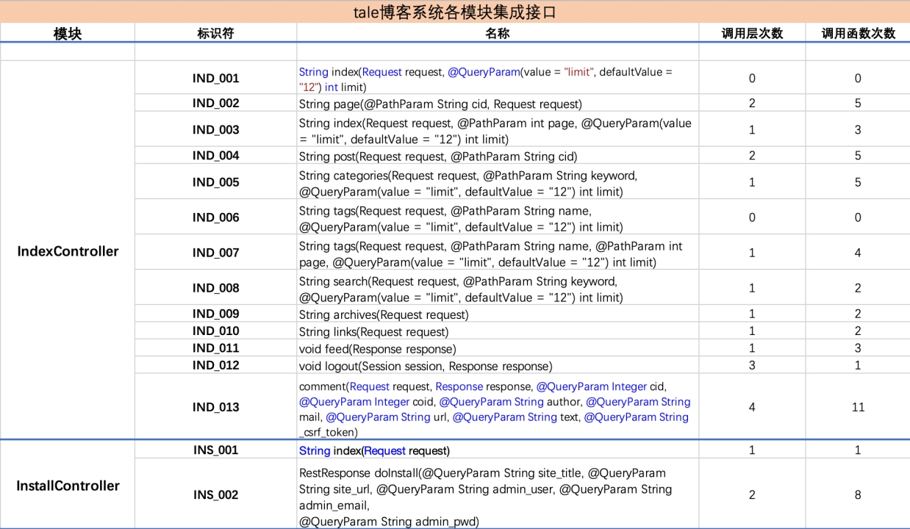

### 3.6 测试结果

主要使用**Postman**对接口进行测试

接口调用关系：

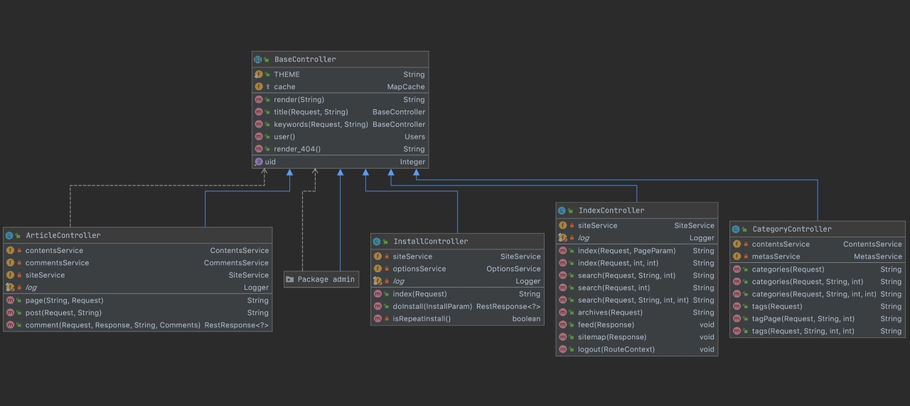

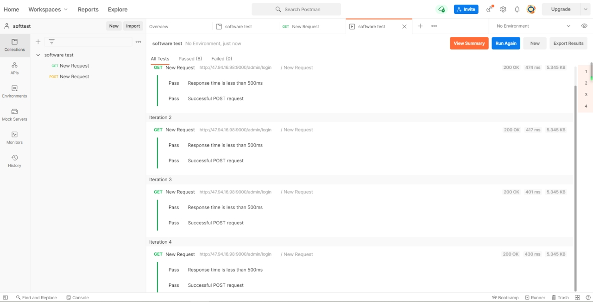

一共设计**测试用例162**个，一共测试了**33个接口**，设计了**86个测试项**。测得实际输出与预期输出不符的测试用例有31个，其中具有可以归为项目缺陷的10个

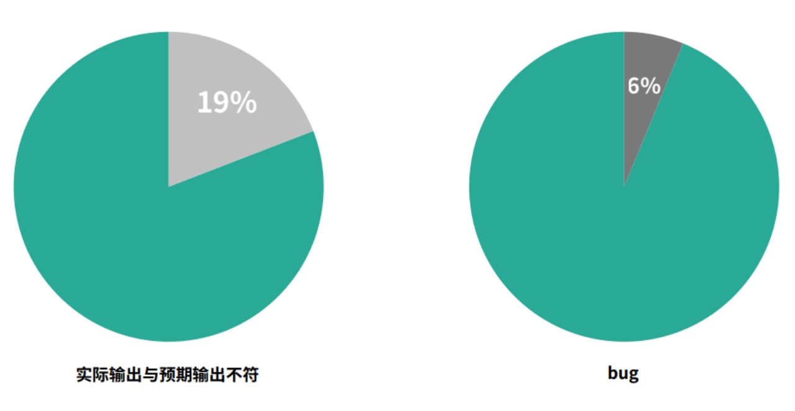

## 4 系统测试

### 4.1 测试工具

**使用禅道进行了bug追踪和项目管理**：

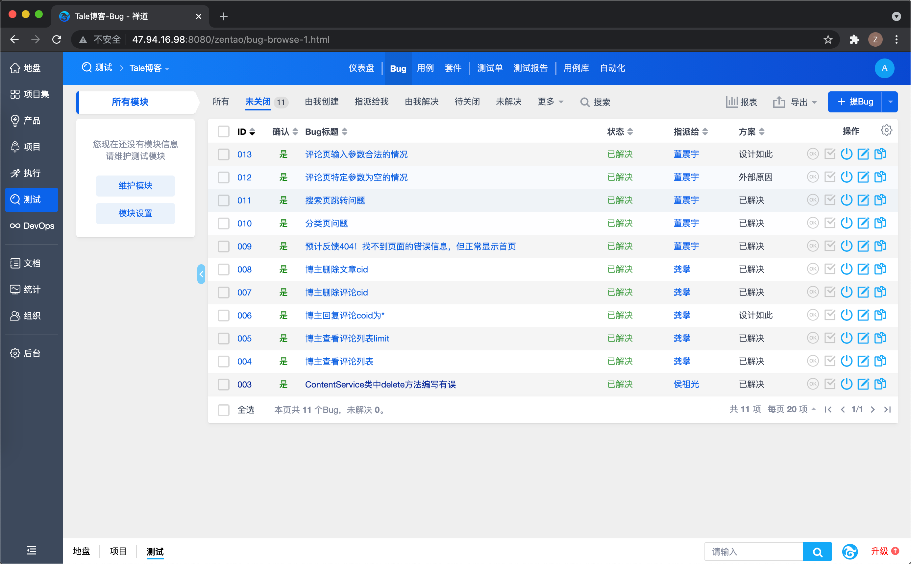

**使用JMeter进行压力测试**：

Apache JMeter 是Apache 组织开发的基于Java 的压力测试工具。用于对软件做压力测试，它最初被设计用于Web应用测试，但后来扩展到其他测试领域。 它可以用于测试静态和动态资源，例如静态文件、Java 小服务程序、CGI 脚本、Java 对象、数据库、FTP 服务器， 等等。JMeter 可以用于对服务器、网络或对象模拟巨大的负载，来自不同压力类别下测试它们的强度和分析整体性能。另外，JMeter 能够对应用程序做功能/回归测试，通过创建带有断言的脚本来验证你的程序返回了你期望的结果。为了最大限度的灵活性，JMeter允许使用正则表达式创建断言。

### 4.2 功能测试

**经讨论，我们准备了管理员信息、文章信息和评论信息进行系统测试。**

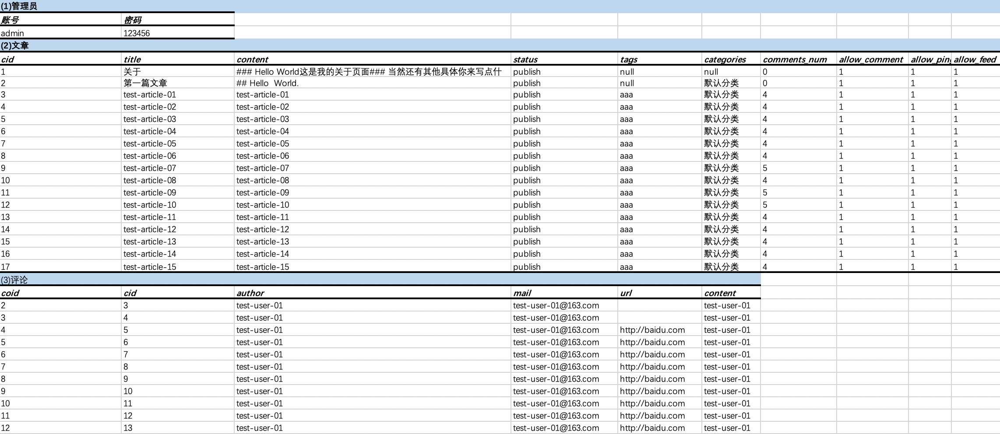

基于系统功能测试分析和用例设计共77个用例：

下图只展示部分测试用例，更多请查看[TALE系统测试用例.xlsx](SystemTesting/TALE系统测试用例.xlsx)

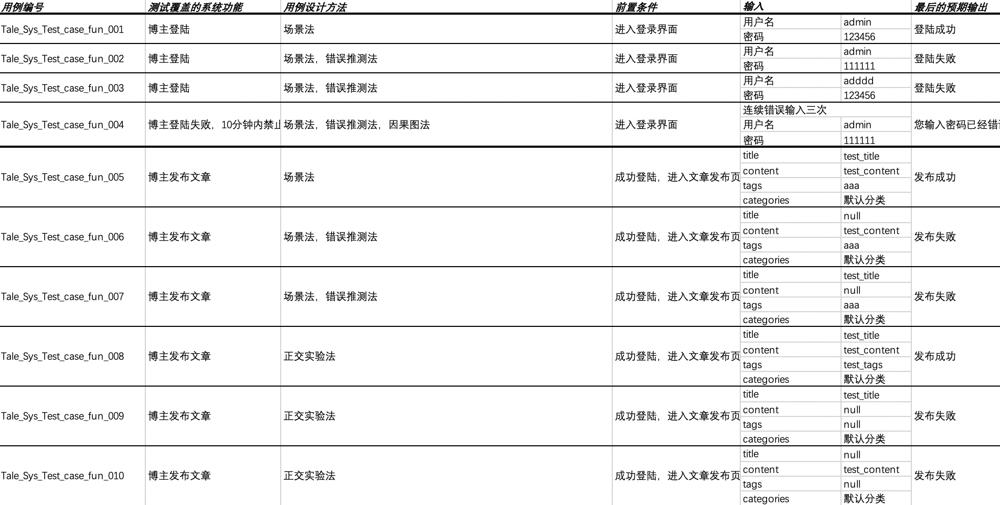

基于系统业务流的测试分析和用例设计共13个用例：

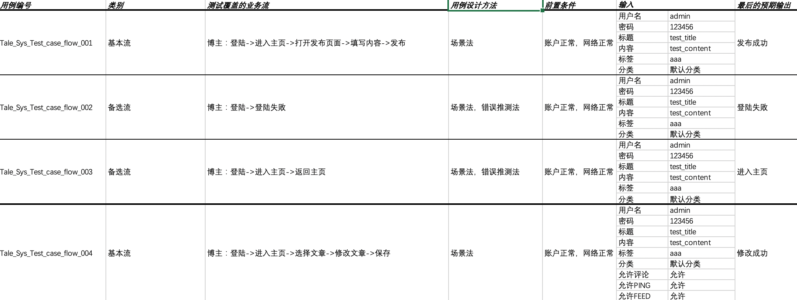

### 4.3 性能测试

我们使用Jmeter进行了简单的系统性能测试，下面是其图表结果。

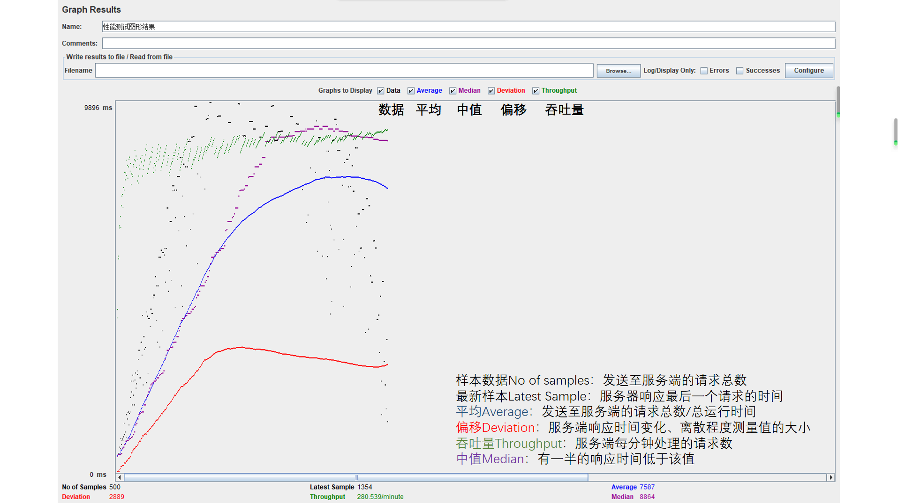

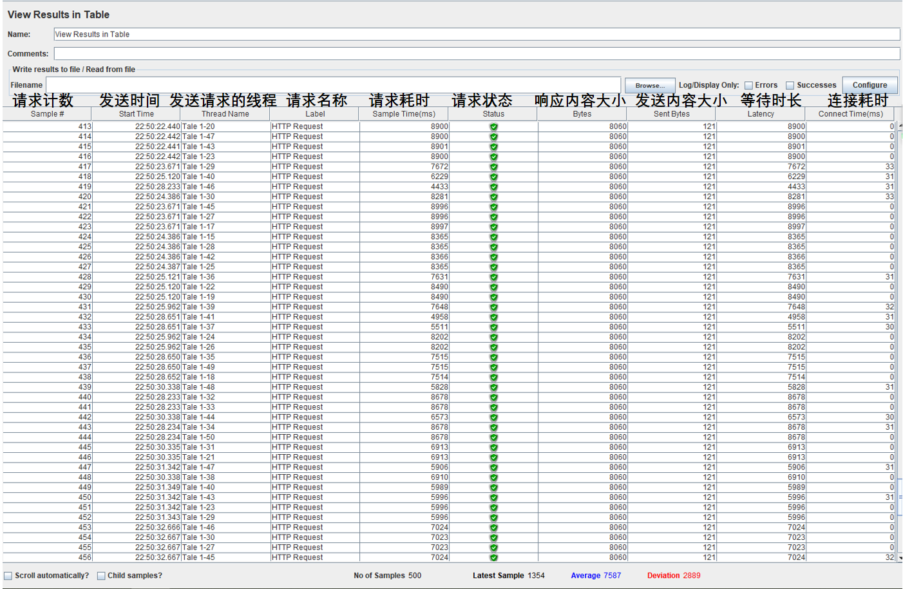

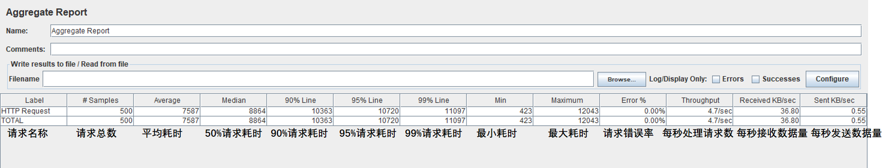

### 4.4 测试结果

本次系统测试针对11 个模块共设计了99 个测试用例。测得实际输出与预期输出不符的测试用例10个，其中具有可以归为项目缺陷的5个。

详情请看：

[系统测试计划书.pdf](SystemTesting/系统测试计划书.pdf)

[系统测试报告.pdf](SystemTesting/系统测试报告.pdf)
