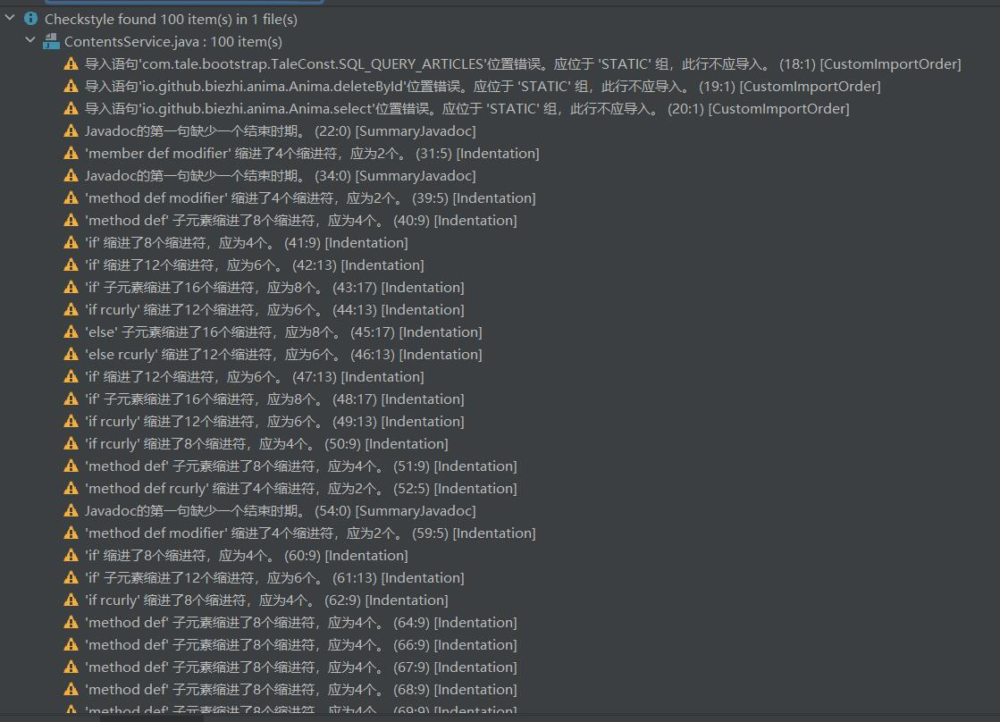
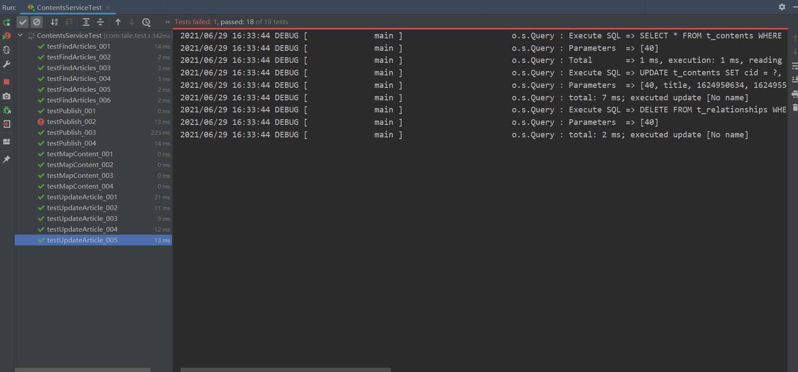

# Tale Blog Software Testing

## 1 项目背景

该项目是同济大学软件学院2021年软件测试的期末项目。我们选择测试的项目是GitHub的开源项目[Tale博客系统](https://github.com/otale/tale)，项目地址为：https://github.com/otale/tale

该系统是一个轻量级Java平台的博客系统，可划分为两个子系统：一个是服务于博客创建者的博客管理系统；另一个是服务于普通用户的博客浏览系统。

团队成员如下：

|  学号   |  姓名  |
| :-----: | :----: |
| 1852143 | 董震宇 |
| 1853360 | 龚  攀 |
| 1853201 | 侯祖光 |
| 1853045 | 秦才植 |

## 2 单元测试

### 2.1 测试工具

- 静态测试工具：CheckStyle

  ​		Checkstyle 是SourceForge 的开源项目，通过检查对代码编码格式，命名约定，Javadoc，类设计等方面进行代码规范和风格的检查，从而有效约束开发人员更好地遵循代码编写规范。

- 动态测试工具：JUnit

  ​		JUnit是一个Java语言的单元测试框架。它由Kent Beck和Erich Gamma建立，逐渐成为源于Kent Beck的sUnit的xUnit家族中最为成功的一个。 JUnit有它自己的JUnit扩展生态圈。多数Java的开发环境都已经集成了JUnit作为单元测试的工具

- 缺陷与Bug跟踪：禅道

### 2.2 测试计划

本次项目合理利用了单元测试的知识，综合了黑盒测试、白盒测试、静态测试、动态测试等方法对Tale Blog项目中的Service模块中的方法进行了完备的单元测试。

测试思路如下：

1. 挑选测试项目并部署，挑选其中具有代表性的Service模块进行单元测试
2. 通过教材案例及项目细节，制定了单元测试计划
3. 通过测试工具部署好测试需要的环境，如动态测试JUnit工具所需要的运行环境及测试类
4. 实行静态测试，通过CheckStyle工具进行自动化代码规范检查，并辅助以人工代码检查
5. 设计并执行测试用例，通过JUnit工具为被测函数生成测试类函数，同时根据测试用例具体情况进行测试代码的编写
6. 在进行测试用例设计时，选用白盒测试思想和技术来检查待测方法是否按照预期工作。主要采用了逻辑覆盖法，条件覆盖法等测试方法
7. 记录静态和动态测试的结果，对于其中出现的Bug和缺陷通过禅道工具进行缺陷跟踪
8. 总结测试结果，编写单元测试报告

### 2.3 单元测试用例

共设计19个测试用例，详情请看：

[单元测试用例设计.pdf](UnitTesting/单元测试用例设计.pdf)

[单元测试用例集.xlsx](UnitTesting/单元测试用例集.xlsx)

### 2.4 测试结果

生成单元测试报告：[单元测试报告.pdf](UnitTesting/单元测试报告.pdf)

生成测试结果：

- [动态测试结果.xlsx](UnitTesting/动态测试结果.xlsx)
- [静态测试结果.xlsx](UnitTesting/静态测试结果.xlsx)

本次单元测试项目共测试了1个类，4个方法，测得静态测试缺陷个数为0个，动态测试缺陷个数为1个。

使用CheckStyle进行静态测试结果显示，代码中除缩进进行了警告外，代码无缺陷。

使用JUnit进行动态测试结果显示，所测的1 个类，4个函数，共19个测试用例中，出现严重缺陷的测试用例为1，测试通过用例为18。

## 3 集成测试
